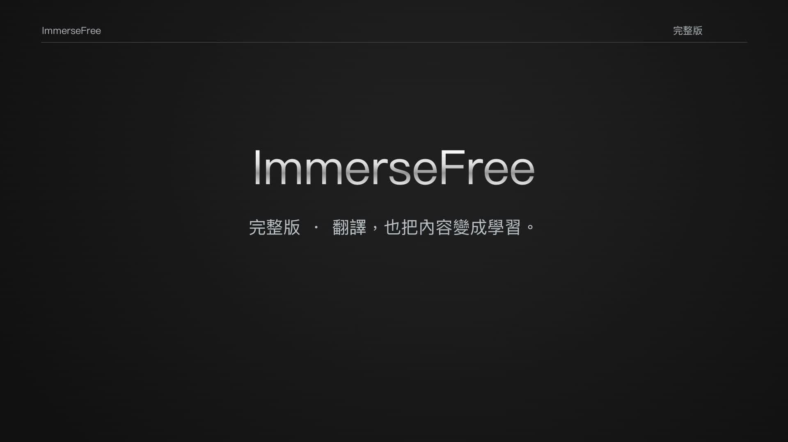

<p align="center">
  
</p>

# ImmerseFree

### 外文不只看得懂，還能帶走真正學會的東西。

**雙語網頁、AI 影片字幕、影片學習、PDF／EPUB 與文件匯出。**
把翻譯、閱讀與學習放回你正在使用的瀏覽器，不必來回複製貼上。

**[下載最新版](https://github.com/chang416/ImmerseFree/releases/latest) · [快速開始](#快速開始--quick-start) · [支持開發](https://buymeacoffee.com/chang416)**

Read the web, watch with context, and turn captions into study notes. ImmerseFree is an open-source browser translator for users worldwide, with a built-in English interface and Traditional Chinese support.

> **功能完整開放，不分付費等級。** ImmerseFree 本身不收訂閱費。翻譯使用你選擇的模型服務，其額度、費用與可用性由該服務決定。
> All features are open. There is no ImmerseFree subscription; your chosen model provider's quotas and charges still apply.

[](https://github.com/chang416/ImmerseFree/releases/download/v0.8.1/ImmerseFree-Promo.mp4)

**[觀看 60 秒宣傳片](https://github.com/chang416/ImmerseFree/releases/download/v0.8.1/ImmerseFree-Promo.mp4)** · 配樂與文字版，無旁白。操作素材沿用前版宣傳片；新版功能與限制以本頁說明為準。

## 從看懂，到用得上

| 你正在做的事 | ImmerseFree 幫你多走一步 |
|---|---|
| 讀文章、查資料 | 譯文直接放在原文旁邊；雙語對照與僅譯文隨時切換。 |
| 看 YouTube | 取得可用字幕後先批次翻譯，依原有時間碼顯示；進度看得見。 |
| 看 Netflix、Disney+ | 同時顯示平台提供的兩條字幕軌，不消耗 AI 翻譯額度。 |
| 想把影片真正學起來 | 從字幕整理符合程度的單字、例句與句型；YouTube 也能使用。 |
| 讀 PDF、EPUB | 使用雙語閱讀與匯出流程，留下可重讀的內容。 |
| 想保留成果 | 匯出雙語 Word、EPUB、PDF 或字幕檔；不同入口對應不同格式。 |
| 只卡在一句話 | 反白翻譯、單字詞典卡、懸停段落，不打斷整頁閱讀。 |

**好用的小地方，也一起做好。** 術語表固定專有名詞譯法，多種雙語顯示主題、可調提示詞、模型選擇與診斷紀錄，讓工具配合你的閱讀方式。

Page translation · AI captions · Official dual subtitles · Video study · Bilingual documents · Glossaries · Selection and hover translation.

[完整功能](docs/FEATURES.md) · [操作與安裝指南](docs/GUIDE.md) · [遇到問題](docs/TROUBLESHOOTING.md)

## 這次更新了什麼

- **銀灰面板重新整理。** 主操作集中、文字不再擠成窄欄，按壓有回饋。
- **YouTube 影片學習加入。** 有原文字幕就能整理教材，不再硬性要求同時具備第二語言字幕。
- **字幕取得更有韌性。** 多條取得路徑各自處理失敗，切換影片時排除舊字幕；批譯進度保留並可重試。
- **雙軌時間與分段再打磨。** 避免重複短句誤對時，跳轉後不沿用舊句，跨軌斷句也能保留多段對應內容。
- **慢服務不再拖住整個面板。** 模型清單載入與按鈕操作分開，連線逾時有明確結果。

[查看更新紀錄](CHANGELOG.md)

## 快速開始 / Quick start

| 系統 | 下載 |
|---|---|
| macOS | [ImmerseFree-macOS.zip](https://github.com/chang416/ImmerseFree/releases/latest/download/ImmerseFree-macOS.zip) |
| Windows | [ImmerseFree-Windows.zip](https://github.com/chang416/ImmerseFree/releases/latest/download/ImmerseFree-Windows.zip) |

1. 下載並解壓縮，執行系統對應的安裝程式。
2. 依安裝程式提示，在 Chrome 或 Edge 手動載入擴充功能。macOS 選資料夾時按 **Command + Shift + G** 貼上路徑；Windows 按 **Ctrl + L** 貼上路徑。
3. 接上你要使用的翻譯引擎，開啟一般網頁或有字幕的影片開始使用。

Download, extract, run your platform's installer, then load the extension manually and connect a model provider. [Detailed bilingual instructions](docs/GUIDE.md#quick-install快速安裝).

**首次安裝需要手動載入。** 目前未上架瀏覽器商店。Safari 另需 Xcode 與自己的 Apple 簽署設定，詳見[安裝指南](docs/GUIDE.md)。

## 模型由你選

- **Antigravity**：使用已登入帳號可用的模型額度。
- **Gemini**：使用自己的服務金鑰。
- **OpenCode**：依服務當下提供的模型與額度使用。
- **相容 OpenAI 的服務**：可設定自己的模型服務或本機端點。

沒有內附金鑰，也不必建立 ImmerseFree 帳號。文字會送到你選擇的引擎；本機引擎由安裝在自己電腦上的橋接服務轉送。

Bring your own provider. No credentials are bundled. The extension sends content to the engine you choose; CLI engines use a local bridge.

## 先知道這幾件事

- 影片功能需要可取得的字幕；不是把任意影片音訊自動轉成字幕。
- Netflix、Disney+ 雙軌需要該片提供指定語言；片單、地區及播放器更新會影響可用性。
- 影片預譯需要等待模型完成，速度取決於字幕長度與服務回應。
- PDF 匯出是重新排版的雙語文件，並非所有文件都能原樣還原版面。
- 目前以桌面瀏覽器為主，沒有手機 App；模型服務也各有使用條件。

Caption access, language availability and provider quotas vary. [Troubleshooting](docs/TROUBLESHOOTING.md).

## 喜歡這個方向，讓它繼續變好

**先下載，用在你每天真的會看的內容上。**
如果它替你少切幾個分頁、讀懂一篇文章，或留下幾個學會的單字，歡迎在右上角點 **Star**，讓更多人找到 ImmerseFree。

我是一名大學生，持續負擔開發工具與 AI 服務的費用。你的贊助會支持後續維護、測試與介面打磨。功能不因贊助與否而區別，支持多少由你決定。

**[請開發者喝杯咖啡](https://buymeacoffee.com/chang416)** · [回報問題或提出建議](https://github.com/chang416/ImmerseFree/issues)

If ImmerseFree helps you, star the project or [support its development](https://buymeacoffee.com/chang416). Donations are optional and never unlock exclusive features.

## 開發與授權

採用 [MIT License](LICENSE)。[第三方授權](THIRD_PARTY_NOTICES.md)與[開發說明](docs/GUIDE.md#for-developers開發者資訊)均公開。

```sh
npm run verify
```

驗證涵蓋共用資源、版本、檔案引用、字幕、模型請求與 PDF 回歸測試。桌面平台的建置檢查由 GitHub Actions 執行。
