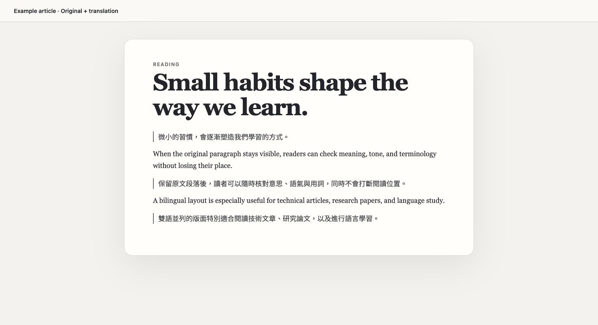

<p align="center">
  
</p>

# ImmerseFree

ImmerseFree is an open-source bilingual browser translator for web pages, selected text, hovered paragraphs, input fields, and PDFs. It keeps the original text visible and inserts the translation underneath it. Windows and macOS are supported; Chrome, Microsoft Edge, and Safari installation paths are included.

ImmerseFree 是一套開源的瀏覽器雙語翻譯工具，可翻譯整個網頁、反白文字、滑鼠懸停段落、輸入欄位與 PDF。它會保留原文，並把譯文插在原文下方。支援 Windows 與 macOS，並提供 Chrome、Microsoft Edge 與 Safari 的安裝方式。

The interface supports English and Traditional Chinese and follows the browser language by default. No API key or private login credential is included in this repository.

介面支援英文與繁體中文，預設跟隨瀏覽器語言。本 repository 不包含任何 API key 或私人登入憑證。

> [!IMPORTANT]
> This is an open-source MVP. Chrome and Edge currently require one manual **Load unpacked** step per browser profile. Safari requires Xcode and your own Apple signing team. These browser security restrictions cannot be bypassed by an installer.

> [!IMPORTANT]
> 這是開源 MVP。Chrome 與 Edge 目前每個瀏覽器設定檔都需要手動執行一次「載入未封裝項目」；Safari 需要 Xcode 與你自己的 Apple 簽署 Team。這些瀏覽器安全限制無法由安裝程式略過。

## Quick install｜快速安裝

### Where to download｜要去哪裡下載

Open the [latest release](https://github.com/chang416/ImmerseFree/releases/latest). On the release page, scroll to **Assets**. If the file list is hidden, click the small triangle next to **Assets** to expand it.

打開 [最新版本下載頁](https://github.com/chang416/ImmerseFree/releases/latest)，往下找到 **Assets**。如果沒有看到檔案清單，請按 **Assets** 左邊的小三角形把清單展開。

- **Windows:** download [`ImmerseFree-Windows.zip`](https://github.com/chang416/ImmerseFree/releases/latest/download/ImmerseFree-Windows.zip).
- **Windows**：下載 [`ImmerseFree-Windows.zip`](https://github.com/chang416/ImmerseFree/releases/latest/download/ImmerseFree-Windows.zip)。
- **macOS:** download [`ImmerseFree-macOS.zip`](https://github.com/chang416/ImmerseFree/releases/latest/download/ImmerseFree-macOS.zip).
- **macOS**：下載 [`ImmerseFree-macOS.zip`](https://github.com/chang416/ImmerseFree/releases/latest/download/ImmerseFree-macOS.zip)。

If a release asset is temporarily unavailable, click the green **Code** button on the repository page, choose **Download ZIP**, unzip it, and follow the same platform instructions below.

如果版本附件暫時無法下載，請在 repository 首頁按綠色的 **Code** 按鈕，再按 **Download ZIP**，解壓縮後依照下方相同的平台教學操作。

### Windows — Chrome or Edge｜Windows — Chrome 或 Edge

1. Right-click the downloaded ZIP and choose **Extract All**. Open the extracted folder, open `Windows`, then double-click **`Install ImmerseFree.cmd`**.
2. The installer copies the required files, starts the local Bridge, configures it to start when you sign in, and opens the browser extension page plus the correct extension folder.
3. In Chrome, turn on **Developer mode** at the top right, click **Load unpacked**, and select the `Extension` folder opened by the installer.
4. In Edge, turn on **Developer mode** in the left sidebar, click **Load unpacked**, and select the same `Extension` folder.

1. 在下載的 ZIP 上按右鍵，選擇 **全部解壓縮**。打開解壓後的資料夾，再打開 `Windows`，接著雙擊 **`Install ImmerseFree.cmd`**。
2. 安裝程式會複製需要的檔案、啟動本機 Bridge、設定登入 Windows 時自動啟動，並替你開啟瀏覽器擴充功能頁面與正確的擴充功能資料夾。
3. 在 Chrome 右上角打開 **開發人員模式**，按 **載入未封裝項目**，選擇安裝程式剛剛開啟的 `Extension` 資料夾。
4. 在 Edge 左側打開 **開發人員模式**，按 **載入解壓縮的擴充功能**，選擇同一個 `Extension` 資料夾。

If Windows shows **Windows protected your PC**, click **More info → Run anyway**. This warning can appear because the downloaded ZIP is not code-signed. You may instead right-click the ZIP before extracting it, choose **Properties**, select **Unblock**, and apply the change.

如果 Windows 顯示 **Windows 已保護您的電腦**，請按 **其他資訊 → 仍要執行**。這個提示可能是因為下載的 ZIP 沒有程式碼簽章。你也可以在解壓前對 ZIP 按右鍵，選擇 **內容**，勾選 **解除封鎖** 後套用。

### macOS — Chrome or Edge｜macOS — Chrome 或 Edge

1. Double-click the downloaded ZIP to unzip it. Open the extracted folder, then open `macOS`.
2. For the first run, open Terminal, drag **`Install ImmerseFree.command`** into the Terminal window, and press Return. macOS may block a downloaded script if you only double-click it the first time.
3. The installer copies the files, starts the local Bridge at login, and opens the browser extension page plus the correct extension folder.
4. In Chrome, open `chrome://extensions`, turn on **Developer mode**, click **Load unpacked**, and select the folder opened by the installer.
5. In Edge, open `edge://extensions`, turn on **Developer mode**, click **Load unpacked**, and select the same folder.

1. 雙擊下載的 ZIP 解壓縮。打開解壓後的資料夾，再打開 `macOS`。
2. 第一次執行時，請先開啟「終端機」，把 **`Install ImmerseFree.command`** 拖進終端機視窗，再按 Return。從網路下載的腳本第一次直接雙擊時，macOS 可能會阻擋它。
3. 安裝程式會複製檔案、設定登入時啟動本機 Bridge，並替你開啟瀏覽器擴充功能頁面與正確的擴充功能資料夾。
4. 在 Chrome 開啟 `chrome://extensions`，打開 **開發人員模式**，按 **載入未封裝項目**，再選擇安裝程式開啟的資料夾。
5. 在 Edge 開啟 `edge://extensions`，打開 **開發人員模式**，按 **載入解壓縮的擴充功能**，再選擇同一個資料夾。

### macOS — Safari｜macOS — Safari

Install the Chrome/Edge version first so the shared Bridge is available. Then open the `macOS` folder and run **`Install or update Safari.command`**. You need the full Xcode app, not only the Command Line Tools. On the first run, Xcode may open and ask you to sign in with an Apple Account and choose a Development Team for both targets. After the build finishes, open **Safari → Settings → Extensions** and enable ImmerseFree.

請先完成上方 Chrome／Edge 版本安裝，讓共用的 Bridge 可以使用。接著打開 `macOS` 資料夾並執行 **`Install or update Safari.command`**。你需要安裝完整的 Xcode App，只有 Command Line Tools 不夠。第一次執行時，Xcode 可能會打開並要求你登入 Apple 帳號，且替兩個 target 選擇 Development Team。建置完成後，請到 **Safari → 設定 → 延伸功能** 啟用 ImmerseFree。

The local Safari script creates a development-signed app for your own Mac. It is not a notarized public installer and cannot be redistributed as-is.

本機 Safari 腳本會替你自己的 Mac 建立開發簽署版本。它不是已公證的公開安裝程式，不能直接拿去重新散布。

## What a translated website looks like｜翻譯後的網站會長這樣

With page translation enabled, ImmerseFree keeps each original paragraph and places the translated paragraph directly below it with a subtle left border. The result looks like this:

開啟整頁翻譯後，ImmerseFree 會保留每一段原文，並以低調的左側線條把譯文放在原文正下方。使用 ImmerseFree 翻譯網站後，看起來會像這樣：



## Features｜功能

| Feature | What happens | 功能 | 實際效果 |
|---|---|---|---|
| Page translation | Translations are inserted below the original paragraphs. | 整頁翻譯 | 譯文插在原文段落下方。 |
| Selected text | Select text and release the mouse to open a translation card. | 反白翻譯 | 選取文字並放開滑鼠後顯示翻譯卡片。 |
| Hover translation | Rest on a paragraph for about 0.7 seconds; cached results appear immediately. | 懸停翻譯 | 在段落上停留約 0.7 秒；有快取時立即顯示。 |
| Input translation | Type in an input field and press Space three times to replace it with the translation. | 輸入框翻譯 | 在輸入欄位打字後連按三次空白鍵，以譯文取代原文。 |
| PDF reader | Reads normal PDFs and uses local OCR for scanned pages when available. | PDF 閱讀器 | 翻譯一般 PDF；可用時以本機 OCR 辨識掃描頁面。 |
| Settings transfer | Export and import settings between computers. | 設定搬家 | 在不同電腦間匯出與匯入設定。 |

## Coming soon｜即將推出

- **AI video subtitles:** translate video subtitles with the selected model.
- **AI 影片字幕**：使用選定的模型翻譯影片字幕。
- **Dual subtitles:** show the original and translated Netflix／Disney+ subtitle tracks together.
- **雙軌字幕**：同時顯示 Netflix／Disney+ 的原文與譯文字幕軌。
- **Episode study:** collect useful vocabulary and sentence patterns from the current episode.
- **影集學習**：整理目前單集裡值得學習的單字與句型。

These entries are already visible in the extension but remain disabled as **Coming soon**. They are not included in version 0.7.0.

這些入口已顯示在擴充功能中，但目前仍為停用的 **Coming soon** 狀態，不包含在 0.7.0 版內。

## Support the developer｜支持開發者

I am a university student. The biggest burden of maintaining open-source projects like ImmerseFree is the cost of software and AI subscriptions. If you would like to support the project, you can make a small contribution through [Buy Me a Coffee](https://buymeacoffee.com/chang416). Contributions are optional and do not unlock extra features.

我是一名大學生。對我來說，維護 ImmerseFree 這類開源專案最大的負擔，是軟體與 AI 服務昂貴的訂閱費。如果你願意支持這個專案，可以透過 [Buy Me a Coffee](https://buymeacoffee.com/chang416) 小額贊助。贊助完全自願，也不會解鎖額外功能。

## Choose a translation engine｜選擇翻譯引擎

Open the browser's Extensions menu, pin ImmerseFree, click its icon, and choose an engine and model. Open **Options** when you need to add an API key or change advanced settings.

打開瀏覽器的「擴充功能」選單，把 ImmerseFree 釘選到工具列，按下它的圖示後選擇翻譯引擎與模型。需要加入 API key 或調整進階設定時，請打開 **選項**。

### Option A — Google Antigravity CLI (`agy`)｜選項 A — Google Antigravity CLI (`agy`)

This is the default local CLI engine. ImmerseFree calls the CLI through a Bridge bound to `127.0.0.1`; the browser extension never receives your Google login token. Usage counts against the quota of the Google account or Gemini API key configured in Antigravity.

這是預設的本機 CLI 引擎。ImmerseFree 會透過只綁定 `127.0.0.1` 的 Bridge 呼叫 CLI；瀏覽器擴充功能不會取得你的 Google 登入 token。用量會計入你在 Antigravity 中設定的 Google 帳號或 Gemini API key 額度。

On macOS, open Terminal and run the official installer:

在 macOS 開啟終端機，執行官方安裝指令：

```sh
curl -fsSL https://antigravity.google/cli/install.sh | bash
```

On Windows, open Windows PowerShell and run the official installer:

在 Windows 開啟 Windows PowerShell，執行官方安裝指令：

```powershell
irm https://antigravity.google/cli/install.ps1 | iex
```

After installation, run `agy`. If no session is saved in the operating system keyring, the CLI opens the browser for Google sign-in. Finish the sign-in, return to the terminal, then run `agy models` to confirm that models are available. Finally, rerun the ImmerseFree installer so its login service can find the new CLI path.

安裝後執行 `agy`。如果作業系統鑰匙圈裡沒有既有 session，CLI 會開啟瀏覽器要求你登入 Google。完成登入並回到終端機後，執行 `agy models`，確認看得到可用模型。最後重新執行 ImmerseFree 安裝程式，讓登入啟動的服務能找到新的 CLI 路徑。

Official references: [Antigravity CLI installation and authentication](https://antigravity.google/docs/cli/install/) and [headless mode](https://antigravity.google/docs/cli/headless/).

官方參考資料：[Antigravity CLI 安裝與驗證](https://antigravity.google/docs/cli/install/)與[無介面模式](https://antigravity.google/docs/cli/headless/)。

### Option B — OpenCode CLI｜選項 B — OpenCode CLI

The local OpenCode route requires the `opencode` executable even when the API-key field in ImmerseFree is empty. OpenCode's free-model roster can change and some free models are explicitly time-limited, so do not rely on one permanent model ID.

本機 OpenCode 路線即使在 ImmerseFree 裡沒有填 API key，也仍然需要安裝 `opencode` 執行檔。OpenCode 的免費模型清單可能改變，而且部分免費模型明確標示為限時提供，因此不要依賴某個永久固定的模型 ID。

On macOS, use the official quick installer or Homebrew:

在 macOS 可使用官方快速安裝程式或 Homebrew：

```sh
curl -fsSL https://opencode.ai/install | bash
# or
brew install anomalyco/tap/opencode
```

On Windows, the native npm or Scoop installation works with ImmerseFree's Bridge:

在 Windows，原生 npm 或 Scoop 安裝方式可搭配 ImmerseFree Bridge：

```powershell
npm install -g opencode-ai
# or
scoop install opencode
```

Run `opencode`, enter `/connect`, select **OpenCode Zen**, complete the sign-in at `opencode.ai/auth`, and paste the API key when requested. Then rerun the ImmerseFree installer and choose **OpenCode** in the extension popup.

執行 `opencode`，輸入 `/connect`，選擇 **OpenCode Zen**，到 `opencode.ai/auth` 完成登入，並在提示時貼上 API key。接著重新執行 ImmerseFree 安裝程式，最後在擴充功能彈出視窗選擇 **OpenCode**。

Official references: [OpenCode installation](https://opencode.ai/docs/#install), [provider authentication](https://opencode.ai/docs/providers/#opencode-zen), and [Zen models and pricing](https://opencode.ai/docs/zen/).

官方參考資料：[OpenCode 安裝](https://opencode.ai/docs/#install)、[服務驗證](https://opencode.ai/docs/providers/#opencode-zen)，以及 [Zen 模型與價格](https://opencode.ai/docs/zen/)。

### Option C — Gemini API key｜選項 C — Gemini API key

1. Open [Google AI Studio](https://aistudio.google.com/apikey) and create a dedicated Gemini API key.
2. Open ImmerseFree **Options**, select **Gemini API**, paste one or more keys, choose a model, and click **Save settings**.
3. If you enter several keys separated by new lines, commas, spaces, or semicolons, ImmerseFree de-duplicates and rotates them automatically when a key is rate-limited.

1. 打開 [Google AI Studio](https://aistudio.google.com/apikey)，建立一把專門給 Gemini 使用的 API key。
2. 打開 ImmerseFree **選項**，選擇 **Gemini API**，貼上一把或多把 key，選擇模型後按 **儲存設定**。
3. 多把 key 可用換行、逗號、空格或分號分隔；ImmerseFree 會自動去除重複項目，並在某把 key 遇到速率限制時輪替。

Use a dedicated, restricted, low-quota key. The key is stored in browser local storage, which is not encrypted, and a settings export contains the key in plaintext. Anyone who can inspect your browser profile or read the export file may obtain it. Never commit a key or exported settings file to GitHub. Revoke and rotate an exposed key immediately.

請使用專用、受限制、低額度的 key。key 會儲存在瀏覽器的本機儲存空間中，而該空間沒有加密；匯出的設定檔也會以明文包含 key。能查看你的瀏覽器設定檔或讀取匯出檔的人，就可能取得它。絕對不要把 key 或設定匯出檔提交到 GitHub。若 key 外洩，請立即撤銷並輪替。

See Google's [Gemini API key security guidance](https://ai.google.dev/gemini-api/docs/api-key#security) and [API key restrictions](https://docs.cloud.google.com/docs/authentication/api-keys#api_key_restrictions).

請參考 Google 的 [Gemini API key 安全指引](https://ai.google.dev/gemini-api/docs/api-key#security)與 [API key 限制設定](https://docs.cloud.google.com/docs/authentication/api-keys#api_key_restrictions)。

### Option D — Custom OpenAI-compatible API｜選項 D — 自訂 OpenAI 相容 API

Open ImmerseFree **Options**, choose **Custom API**, enter a base URL such as `https://api.openai.com/v1`, enter the API key if the endpoint requires one, and click **Fetch models**. Select a returned model and save. The endpoint must implement `GET /models` and `POST /chat/completions`. OpenAI, Groq, Together, OpenRouter, DeepSeek, Ollama, and LM Studio can work when configured with a compatible endpoint.

打開 ImmerseFree **選項**，選擇 **自訂 API**，輸入例如 `https://api.openai.com/v1` 的 base URL；如果端點需要驗證，再輸入 API key，接著按 **取得模型**。從回傳清單選擇模型並儲存。端點必須提供 `GET /models` 與 `POST /chat/completions`。只要端點相容，OpenAI、Groq、Together、OpenRouter、DeepSeek、Ollama 與 LM Studio 都可使用。

Use HTTPS for remote endpoints. Reserve `http://` for a local service you explicitly trust, such as Ollama or LM Studio on your own computer. The browser may ask you to approve access to the custom host; approve only the exact host you entered.

遠端端點請使用 HTTPS。`http://` 只應用在你明確信任的本機服務，例如自己電腦上的 Ollama 或 LM Studio。瀏覽器可能會要求允許存取自訂主機；請只核准你親自輸入的那個主機。

## How to use it｜如何使用

### Translate a whole page｜翻譯整個網頁

Open a normal `http://` or `https://` page, click the ImmerseFree toolbar icon, choose the engine/model, and click **Translate page**. Click the same action again to remove the inserted translations.

打開一般的 `http://` 或 `https://` 網頁，按工具列上的 ImmerseFree 圖示，選擇引擎／模型，再按 **翻譯網頁**。再次執行相同動作即可移除插入的譯文。

### Translate selected text or a paragraph｜翻譯反白文字或段落

Select text and release the mouse to show a translation card. To use hover translation, enable it in Options and rest the pointer on a paragraph for about 0.7 seconds.

反白選取文字並放開滑鼠後會顯示翻譯卡片。若要使用懸停翻譯，請先在「選項」中啟用，接著把游標停在段落上約 0.7 秒。

### Translate an input field｜翻譯輸入欄位

Type in a supported text field and press Space three times. ImmerseFree replaces the current text with its translation. Password, email, number, URL, and telephone fields are excluded.

在支援的文字欄位輸入內容後，連按三次空白鍵。ImmerseFree 會用譯文取代目前文字。密碼、Email、數字、網址與電話欄位不會套用。

### Translate a PDF｜翻譯 PDF

Open a PDF in the browser, open the ImmerseFree popup, and start PDF translation. Normal PDFs use their text layer. Scanned pages use the local Windows OCR or macOS Vision helper when available. Password-protected, damaged, or non-PDF responses cannot be read.

在瀏覽器中開啟 PDF，打開 ImmerseFree 彈出視窗並開始 PDF 翻譯。一般 PDF 會使用內建文字層；掃描頁面則在可用時使用本機 Windows OCR 或 macOS Vision 元件。受密碼保護、已損壞，或連結實際沒有回傳 PDF 的檔案無法讀取。

For local `file://` PDFs in Chrome or Edge, open the extension details page and enable **Allow access to file URLs** if the browser asks for it.

若要在 Chrome 或 Edge 翻譯本機 `file://` PDF，請打開擴充功能詳細資料頁；如果瀏覽器要求，請啟用 **允許存取檔案網址**。

## Manual browser installation｜手動安裝瀏覽器擴充功能

### Chrome unpacked installation｜Chrome 未封裝安裝

1. Download and unzip the repository.
2. Enter `chrome://extensions` in the address bar.
3. Turn on **Developer mode** at the top right.
4. Click **Load unpacked**.
5. Select the repository's `Extension` folder—the folder that directly contains `manifest.json`.
6. After updating the source, return to this page and click the extension's **Reload** button, then refresh the website being tested.

1. 下載並解壓縮 repository。
2. 在網址列輸入 `chrome://extensions`。
3. 打開右上角的 **開發人員模式**。
4. 按 **載入未封裝項目**。
5. 選擇 repository 裡的 `Extension` 資料夾，也就是打開後會直接看到 `manifest.json` 的那一層。
6. 更新原始碼後，回到這個頁面按擴充功能卡片上的 **重新載入**，再重新整理正在測試的網站。

Official Chrome instructions: [Load an unpacked extension](https://developer.chrome.com/docs/extensions/get-started/tutorial/hello-world#load-unpacked).

Chrome 官方教學：[載入未封裝擴充功能](https://developer.chrome.com/docs/extensions/get-started/tutorial/hello-world#load-unpacked)。

### Edge unpacked installation｜Edge 未封裝安裝

1. Download and unzip the repository.
2. Enter `edge://extensions` in the address bar, or open **Extensions → Manage extensions**.
3. Turn on **Developer mode** in the left sidebar.
4. Click **Load unpacked**.
5. Select the repository's `Extension` folder.
6. After updating the source, click **Reload** on the extension card and refresh the tested website.

1. 下載並解壓縮 repository。
2. 在網址列輸入 `edge://extensions`，或打開 **擴充功能 → 管理擴充功能**。
3. 打開左側的 **開發人員模式**。
4. 按 **載入解壓縮的擴充功能**。
5. 選擇 repository 裡的 `Extension` 資料夾。
6. 更新原始碼後，按擴充功能卡片上的 **重新載入**，再重新整理正在測試的網站。

Official Edge instructions: [Sideload an extension](https://learn.microsoft.com/en-us/microsoft-edge/extensions/getting-started/extension-sideloading).

Edge 官方教學：[側載擴充功能](https://learn.microsoft.com/en-us/microsoft-edge/extensions/getting-started/extension-sideloading)。

## Package and publish the extension｜封裝與上架擴充功能

### Chrome CRX for development｜Chrome 開發用 CRX

Open `chrome://extensions`, turn on **Developer mode**, and click **Pack extension**. Set **Extension root directory** to `Extension`. On the first pack, leave the private-key field empty. Chrome creates a `.crx` package and a `.pem` private key. Keep the `.pem` secret and backed up; updates to the same packed extension require the same key. Never commit it to GitHub.

打開 `chrome://extensions`，啟用 **開發人員模式**，再按 **封裝擴充功能**。把 **擴充功能根目錄** 指向 `Extension`。第一次封裝時，私密金鑰欄位留空。Chrome 會建立 `.crx` 封裝與 `.pem` 私密金鑰。請把 `.pem` 保密並妥善備份；更新同一個封裝擴充功能時需要使用同一把 key。絕對不要把它提交到 GitHub。

A locally packed CRX is for development or managed enterprise deployment. Ordinary Windows and macOS Chrome users cannot one-click install an arbitrary self-hosted CRX; public installation normally requires the Chrome Web Store.

本機封裝的 CRX 適合開發或受管理的企業部署。一般 Windows 與 macOS Chrome 使用者不能用單擊方式安裝任意自行託管的 CRX；公開安裝通常必須透過 Chrome Web Store。

### Publish to Chrome Web Store｜上架 Chrome Web Store

Each GitHub release includes a ready-to-upload [`ImmerseFree-Chromium-Web-Store.zip`](https://github.com/chang416/ImmerseFree/releases/latest/download/ImmerseFree-Chromium-Web-Store.zip). Verify its manifest key and extension ID against your Web Store item before publishing.

每個 GitHub release 都會附上可直接上傳的 [`ImmerseFree-Chromium-Web-Store.zip`](https://github.com/chang416/ImmerseFree/releases/latest/download/ImmerseFree-Chromium-Web-Store.zip)。發布前仍須把其中的 manifest key 與擴充功能 ID 對照你的 Web Store item。

1. Make a ZIP containing the **contents** of `Extension`, with `manifest.json` at the ZIP root.
2. Register a [Chrome Web Store developer account](https://chrome.google.com/webstore/devconsole/).
3. Click **New item**, upload the ZIP, and complete **Store listing**, **Privacy**, and **Distribution**.
4. Before publishing, open the item's **Package → View public key**, put that public key in the manifest `key`, reload the unpacked extension, and confirm its ID matches the Web Store Item ID.
5. If the key changes, update the allowed Chromium origin in `Bridge/server.mjs` at the same time and retest the Bridge.
6. Submit the item for review.

1. 把 `Extension` 裡面的**內容**壓成 ZIP，並確保 `manifest.json` 位於 ZIP 根目錄。
2. 註冊 [Chrome Web Store 開發者帳號](https://chrome.google.com/webstore/devconsole/)。
3. 按 **New item**，上傳 ZIP，並完成 **Store listing**、**Privacy** 與 **Distribution**。
4. 發布前，打開項目的 **Package → View public key**，把該 public key 放進 manifest 的 `key`，重新載入未封裝擴充功能，並確認它的 ID 與 Web Store Item ID 完全相同。
5. 如果 key 改變，必須同時更新 `Bridge/server.mjs` 允許的 Chromium origin，並重新測試 Bridge。
6. 送交審核。

Official references: [Publish in the Chrome Web Store](https://developer.chrome.com/docs/webstore/publish), [distribution rules](https://developer.chrome.com/docs/extensions/how-to/distribute), and [keeping a consistent extension ID](https://developer.chrome.com/docs/extensions/reference/manifest/key#keep-a-consistent-extension-id).

官方參考資料：[上架 Chrome Web Store](https://developer.chrome.com/docs/webstore/publish)、[散布規則](https://developer.chrome.com/docs/extensions/how-to/distribute)，以及[維持固定擴充功能 ID](https://developer.chrome.com/docs/extensions/reference/manifest/key#keep-a-consistent-extension-id)。

### Publish to Microsoft Edge Add-ons｜上架 Microsoft Edge Add-ons

You may upload the same release asset, [`ImmerseFree-Chromium-Web-Store.zip`](https://github.com/chang416/ImmerseFree/releases/latest/download/ImmerseFree-Chromium-Web-Store.zip), to Partner Center. Complete the Edge-ID allowlist step below before announcing the store build.

你可以把同一份 release 附件 [`ImmerseFree-Chromium-Web-Store.zip`](https://github.com/chang416/ImmerseFree/releases/latest/download/ImmerseFree-Chromium-Web-Store.zip) 上傳到 Partner Center。對外發布商店版本前，必須完成下方的 Edge ID allowlist 步驟。

1. Use the same ZIP whose root contains the Chromium `manifest.json` and extension files.
2. Register a [Microsoft Edge extension developer account](https://learn.microsoft.com/en-us/microsoft-edge/extensions/publish/create-dev-account).
3. In Partner Center, create a new extension, upload the ZIP, and complete availability, properties, privacy, store listing, and certification notes.
4. Submit it for certification.
5. After Microsoft assigns the final Edge Add-ons extension ID, add `chrome-extension://<EDGE_ID>` to the Bridge allowlist while retaining the Chrome origin, then test the actual store-installed build. The store ID may differ from the sideloaded ID.

1. 使用同一份 ZIP，並確保 Chromium `manifest.json` 與所有擴充功能檔案都位於 ZIP 根目錄。
2. 註冊 [Microsoft Edge 擴充功能開發者帳號](https://learn.microsoft.com/en-us/microsoft-edge/extensions/publish/create-dev-account)。
3. 在 Partner Center 建立新擴充功能、上傳 ZIP，並完成可用性、屬性、隱私、商店介紹與驗證備註。
4. 送交 certification。
5. Microsoft 指派正式 Edge Add-ons 擴充功能 ID 後，請在保留 Chrome origin 的同時，把 `chrome-extension://<EDGE_ID>` 加入 Bridge allowlist，接著實際測試從商店安裝的版本。商店 ID 可能與側載版本 ID 不同。

Official reference: [Publish a Microsoft Edge extension](https://learn.microsoft.com/en-us/microsoft-edge/extensions/publish/publish-extension).

官方參考資料：[發布 Microsoft Edge 擴充功能](https://learn.microsoft.com/en-us/microsoft-edge/extensions/publish/publish-extension)。

### Package and distribute Safari｜封裝與散布 Safari 版本

This repository already contains a converted Safari Web Extension Xcode project. For local use, run `macOS/Install or update Safari.command`; do not reconvert it every time. The script synchronizes the shared `Extension` files, builds the containing app and extension, signs with your selected Apple Development Team, installs the app, and registers the extension.

這個 repository 已經包含轉換完成的 Safari Web Extension Xcode 專案。本機使用時請執行 `macOS/Install or update Safari.command`，不需要每次重新轉換。腳本會同步共用的 `Extension` 檔案、建置 containing app 與 extension、用你選擇的 Apple Development Team 簽署、安裝 App，並註冊延伸功能。

If you intentionally recreate the Safari project from the Chromium source, use Apple's current packager on a Mac with Xcode:

只有在你刻意要從 Chromium 原始碼重新建立 Safari 專案時，才在裝有 Xcode 的 Mac 執行 Apple 目前的 packager：

```sh
xcrun safari-web-extension-packager /path/to/Extension
```

For public distribution, join the Apple Developer Program, select the correct distribution signing identities for both the containing app and extension, create an Xcode archive, and choose one route: upload through App Store Connect for Mac App Store review, or sign with Developer ID and notarize for distribution outside the Mac App Store. An Apple Development signature from the local installer is not a public distribution signature.

若要公開散布，請加入 Apple Developer Program，替 containing app 與 extension 選擇正確的 distribution signing identity，建立 Xcode archive，並選擇其中一條路線：透過 App Store Connect 上傳並接受 Mac App Store 審核，或使用 Developer ID 簽署並完成 notarization 後在 Mac App Store 以外散布。本機安裝器使用的 Apple Development 簽署並不是公開散布簽署。

Official references: [package a Safari Web Extension](https://developer.apple.com/documentation/safariservices/packaging-a-web-extension-for-safari), [run it](https://developer.apple.com/documentation/safariservices/running-your-safari-web-extension), and [distribute it](https://developer.apple.com/documentation/safariservices/distributing-your-safari-web-extension).

官方參考資料：[封裝 Safari Web Extension](https://developer.apple.com/documentation/safariservices/packaging-a-web-extension-for-safari)、[執行](https://developer.apple.com/documentation/safariservices/running-your-safari-web-extension)，以及[散布](https://developer.apple.com/documentation/safariservices/distributing-your-safari-web-extension)。

## Requirements｜系統需求

| Component | Minimum | 元件 | 最低需求 |
|---|---|---|---|
| Windows | Windows 10 version 1607, 64-bit | Windows | Windows 10 1607，64 位元 |
| macOS for Chrome/Edge | macOS 11 Big Sur | Chrome／Edge 的 macOS | macOS 11 Big Sur |
| macOS for Safari runtime | macOS 13 Ventura | Safari 執行環境 | macOS 13 Ventura |
| Safari build machine | macOS 14.5+ with Xcode 16+ | Safari 建置電腦 | macOS 14.5 以上與 Xcode 16 以上 |
| Node.js | Node.js 22 LTS or newer | Node.js | Node.js 22 LTS 以上 |
| Chrome / Edge | Version 99 or newer | Chrome／Edge | 99 版以上 |

On macOS 11 or 12, install Node.js 22 LTS rather than Node.js 24, because Node.js 24 requires macOS 13.5 or newer. Homebrew automatically selects the correct Intel or Apple Silicon build.

若使用 macOS 11 或 12，請安裝 Node.js 22 LTS，不要安裝 Node.js 24，因為 Node.js 24 需要 macOS 13.5 以上。Homebrew 會自動選擇正確的 Intel 或 Apple Silicon 版本。

Windows scanned-PDF OCR uses the built-in `Windows.Media.Ocr` through Windows PowerShell 5.1. Install the needed Windows language pack under **Settings → Time & Language → Language → Language options → Basic typing**. PowerShell 7 is not used for the OCR helper.

Windows 掃描 PDF OCR 會透過 Windows PowerShell 5.1 使用內建的 `Windows.Media.Ocr`。請到 **設定 → 時間與語言 → 語言 → 語言選項 → 基本輸入** 安裝需要的 Windows 語言套件。OCR helper 不使用 PowerShell 7。

macOS scanned-PDF OCR uses Apple's Vision framework. The installer compiles a small Swift helper on your Mac. If `swiftc` is unavailable, install Xcode Command Line Tools with `xcode-select --install` and rerun the installer.

macOS 掃描 PDF OCR 使用 Apple Vision framework。安裝程式會在你的 Mac 上編譯一個小型 Swift helper。如果找不到 `swiftc`，請執行 `xcode-select --install` 安裝 Xcode Command Line Tools，再重新執行安裝程式。

## Privacy and security｜隱私與安全

The Bridge listens only on `127.0.0.1`. All non-minimal endpoints require an allowed extension origin, and translation/OCR POST requests additionally require the ImmerseFree request header. `GET /health` without an origin returns only `{"ok":true}` so installers can check whether the service started.

Bridge 只監聽 `127.0.0.1`。除了最小健康檢查之外，所有端點都要求通過允許的擴充功能 origin；翻譯／OCR POST 請求還另外要求 ImmerseFree request header。沒有 origin 的 `GET /health` 只會回傳 `{"ok":true}`，供安裝程式確認服務是否啟動。

Translation content is sent to the engine you select. Gemini and remote custom APIs receive requests directly from the extension. Antigravity and OpenCode CLI requests pass through the local Bridge to the installed CLI. Scanned PDF OCR normally runs locally; the Antigravity vision fallback, when used, sends the rendered page image to the selected Antigravity model.

翻譯內容會送到你選擇的引擎。Gemini 與遠端自訂 API 由擴充功能直接發出請求；Antigravity 與 OpenCode CLI 請求則經過本機 Bridge 送到已安裝的 CLI。掃描 PDF OCR 通常在本機執行；如果使用 Antigravity 視覺備援，轉成圖片的 PDF 頁面會傳送給選定的 Antigravity 模型。

The Bridge runs Antigravity vision OCR in a sandboxed temporary working directory and does not auto-approve all CLI tool calls. Temporary images are deleted after each request.

Bridge 會在受沙盒限制的暫存工作目錄執行 Antigravity 視覺 OCR，而且不會自動核准全部 CLI 工具呼叫。每次請求完成後會刪除暫存圖片。

API keys entered in the extension are stored locally but are not encrypted. Settings exports contain the keys in plaintext. Protect and delete exports after transfer. If you need stronger secret isolation for a production deployment, use a backend proxy and keep provider credentials on the server.

輸入擴充功能的 API key 會儲存在本機，但沒有加密。設定匯出檔會以明文包含 key。搬移設定後請妥善保護並刪除匯出檔。正式部署若需要更強的秘密隔離，請使用後端 proxy，把 provider 憑證留在伺服器端。

## Move settings to another computer｜把設定搬到另一台電腦

On the old computer, open ImmerseFree **Options** and click **Export settings**. Move the JSON file securely. On the new computer, install ImmerseFree, open **Options**, and click **Import settings**. Verify the engine, model, and permissions, then delete the JSON file because it contains API keys in plaintext.

在舊電腦打開 ImmerseFree **選項**，按 **匯出設定**，再用安全方式移動 JSON 檔。在新電腦安裝 ImmerseFree，打開 **選項**並按 **匯入設定**。確認引擎、模型與權限後，請刪除 JSON 檔，因為檔案會以明文包含 API key。

## Uninstall｜解除安裝

On Windows, open the installed or downloaded `Windows` folder and double-click **`Uninstall ImmerseFree.cmd`**. Then remove the extension from each Chrome/Edge profile through the browser's extension page.

在 Windows 打開已安裝或下載的 `Windows` 資料夾，雙擊 **`Uninstall ImmerseFree.cmd`**。接著到瀏覽器擴充功能頁面，從每個 Chrome／Edge 設定檔移除擴充功能。

On macOS, run **`macOS/Uninstall ImmerseFree.command`**. Then remove the extension from Chrome/Edge. For Safari, disable the extension in Safari Settings and remove `ImmerseFree.app` from `/Applications` or `~/Applications` if it remains.

在 macOS 執行 **`macOS/Uninstall ImmerseFree.command`**，再從 Chrome／Edge 移除擴充功能。Safari 請先到 Safari 設定停用延伸功能；如果 `/Applications` 或 `~/Applications` 仍有 `ImmerseFree.app`，再把它移除。

## For developers｜開發者資訊

The repository layout is:

Repository 結構如下：

```text
Extension/     shared Manifest V3 extension for Chrome and Edge
Bridge/        local service on 127.0.0.1:27843, CLI engines, and OCR
Windows/       Windows installer, launcher, uninstaller, and OCR helper
macOS/         macOS installer, OCR source, and Safari Xcode project
test/          Node.js regression tests
scripts/       project integrity checks
docs/          screenshots and official-source research notes
```

Run the complete cross-platform-independent verification suite with Node.js 22 or newer:

使用 Node.js 22 以上執行不依賴特定平台的完整驗證：

```sh
npm run verify
```

This validates manifests and referenced files, checks that Chromium and Safari shared resources match, derives the Chromium extension ID from the manifest key and compares it with the Bridge allowlist, scans for common committed-secret patterns, and runs regression tests for provider parsing, settings, batching, PDF handling, and platform helpers.

這會驗證 manifests 與所有引用檔案、確認 Chromium 與 Safari 的共用資源一致、從 manifest key 推導 Chromium 擴充功能 ID 並與 Bridge allowlist 比對、掃描常見誤提交 secret 模式，並執行 provider 解析、設定、批次、PDF 處理與平台 helper 的回歸測試。

To verify the Safari app without signing:

若要在不簽署的情況下驗證 Safari App：

```sh
xcodebuild \
  -project "macOS/Safari/ImmerseFree.xcodeproj" \
  -scheme ImmerseFree \
  -configuration Release \
  -destination "platform=macOS" \
  -derivedDataPath /tmp/immersefree-xcode-check \
  CODE_SIGNING_ALLOWED=NO \
  clean build
```

GitHub Actions repeats Node verification on Windows and macOS, parses every Windows PowerShell script, and builds the unsigned Safari app.

GitHub Actions 會在 Windows 與 macOS 重跑 Node 驗證、解析每一支 Windows PowerShell 腳本，並建置未簽署的 Safari App。

Before publishing Chrome or Edge store builds, reconcile each store's final extension ID with the Bridge origin allowlist and test the actual store-installed package. Sideloaded-ID testing alone is insufficient.

發布 Chrome 或 Edge 商店版本前，必須把每個商店最後指派的擴充功能 ID 與 Bridge origin allowlist 對齊，並實際測試從商店安裝的封裝。只測側載版本 ID 並不足夠。

## License｜授權

MIT License. See [`LICENSE`](LICENSE). Bundled third-party components and their licenses are listed in [`THIRD_PARTY_NOTICES.md`](THIRD_PARTY_NOTICES.md).

採用 MIT License，詳見 [`LICENSE`](LICENSE)。內含第三方元件與授權資訊列於 [`THIRD_PARTY_NOTICES.md`](THIRD_PARTY_NOTICES.md)。
